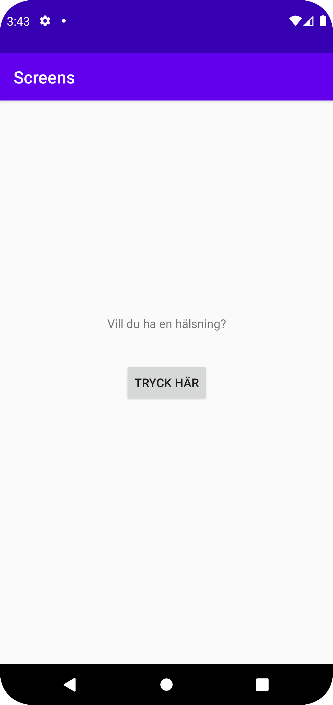
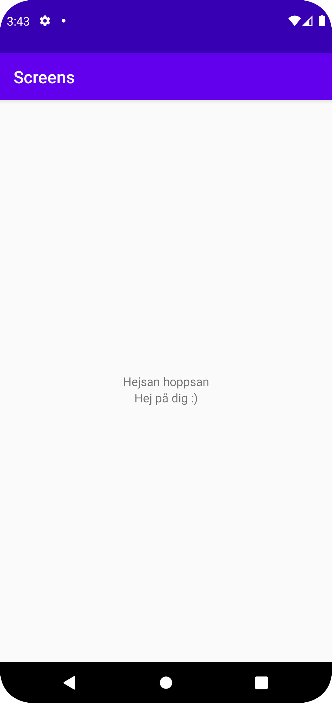

# Rapport

Har skapat en andra activity.xml, så att två olika sidor ska finnas. En knapp har lagts till på första
sidan, som ska leda till den andra sidan. Det finns en intent med data, den texten skrivs ut då den
andra activity-sidan öppnas. Två textViews har lagts till på andra activity-sidan. En knapp och en textView på första sidan.

Programkoden nedan visar att det finns en knapp som ska gå att klicka på. Inuti onClick visar koden att då knappen klickas på,
tas man från MainActivity-sidan, till MainActivity2. Intent.putExtra är sträng med text, texten kommer skrivas ut på den andra
activity-sidan inuti en textView.
```
Button b = findViewById(R.id.button);
b.setOnClickListener(new View.OnClickListener() {
     @Override
     public void onClick(View view) {
        Log.d("==>","Du är på väg");
        Intent intent = new Intent(MainActivity.this, MainActivity2.class);
        intent.putExtra("name", "Hejsan hoppsan");
        startActivity(intent);
}
});
```

Bilder läggs i samma mapp som markdown-filen.




Läs gärna:

- Boulos, M.N.K., Warren, J., Gong, J. & Yue, P. (2010) Web GIS in practice VIII: HTML5 and the canvas element for interactive online mapping. International journal of health geographics 9, 14. Shin, Y. &
- Wunsche, B.C. (2013) A smartphone-based golf simulation exercise game for supporting arthritis patients. 2013 28th International Conference of Image and Vision Computing New Zealand (IVCNZ), IEEE, pp. 459–464.
- Wohlin, C., Runeson, P., Höst, M., Ohlsson, M.C., Regnell, B., Wesslén, A. (2012) Experimentation in Software Engineering, Berlin, Heidelberg: Springer Berlin Heidelberg.
